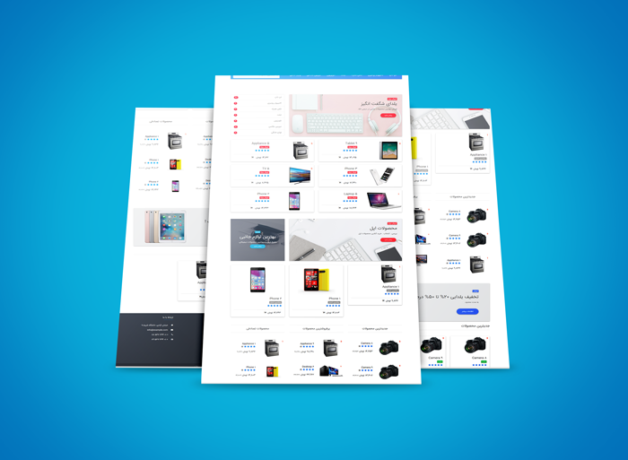
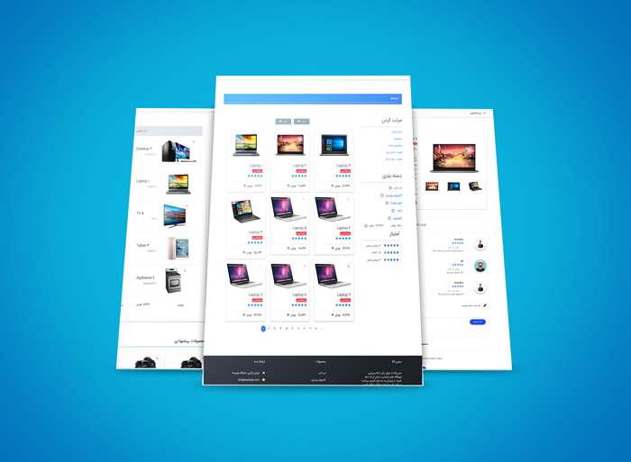

<p align="center"><a href="https://github.com/kooshkestani/shop" target="_blank"></a></p>

<p align="center">
<a href="https://travis-ci.org/the-control-group/voyager"></a>
<a href="https://styleci.io/repos/72069409/shield?style=flat"></a>
<a href="https://packagist.org/packages/tcg/voyager"></a>
<a href="https://packagist.org/packages/tcg/voyager"></a>
<a href="https://packagist.org/packages/tcg/voyager"></a>
<a href="https://github.com/larapack/awesome-voyager"></a>
</p>

# **E**commerce - Online Shopping Persian -rtl-ltr
Made with ❤️ by [shop](https://github.com/kooshkestani/shop)





Website & Documentation: https://github.com/kooshkestani/shop

Video Tutorial Here: https://github.com/kooshkestani/shop

Join our Slack chat: https://github.com/kooshkestani/shop


<hr>

Laravel Admin & BREAD System (Browse, Read, Edit, Add, & Delete), supporting Laravel 5.4, 5.5, 5.6 and 5.7!

## Installation Steps

### 1. Require the Package

After creating your new Laravel application you can include the Voyager package with the following command: 

```bash
composer install
```

### 2. Add the DB Credentials & APP_URL

Next make sure to create a new database and add your database credentials to your .env file:

import db_shop.sql in php my admin 
```
DB_HOST=localhost
DB_DATABASE=homestead
DB_USERNAME=homestead
DB_PASSWORD=secret
```

You will also want to update your website URL inside of the `APP_URL` variable inside the .env file:

```
APP_URL=http://localhost:8000
```

> Troubleshooting: **Specified key was too long error**. If you see this error message you have an outdated version of MySQL, use the following solution: https://laravel-news.com/laravel-5-4-key-too-long-error

And we're all good to go!

Start up a local development server with `php artisan serve` And, visit [http://localhost:8000/admin](http://localhost:8000/admin).

## Creating an Admin User

If you did go ahead with the dummy data, a user should have been created for you with the following login credentials:

>**email:** `admin@admin.com`   
>**password:** `password`

NOTE: Please note that a dummy user is **only** created if there are no current users in your database.

If you did not go with the dummy user, you may wish to assign admin privileges to an existing user.
This can easily be done by running this command:

```bash
php artisan voyager:admin your@email.com
```

If you did not install the dummy data and you wish to create a new admin user you can pass the `--create` flag, like so:

```bash
php artisan voyager:admin your@email.com --create
```

And you will be prompted for the user's name and password.
